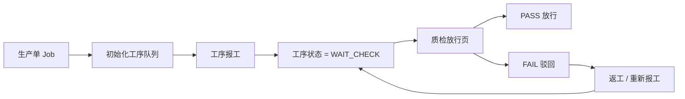
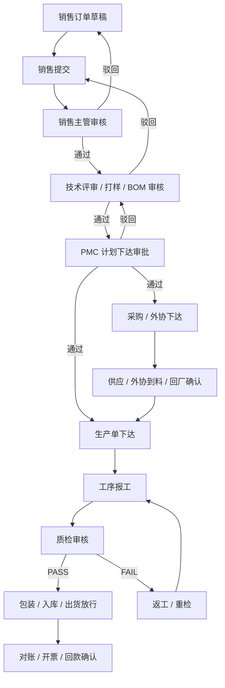
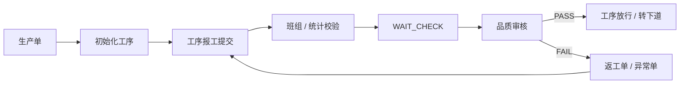
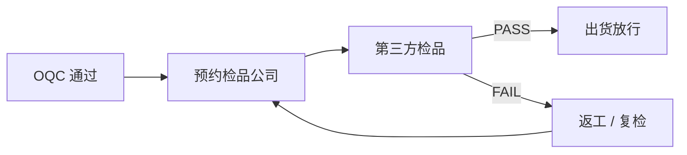

# 针织服装 ERP / MES 审批流程图现状与补充规划

最后更新：2026-04-24

## 1. 说明

本文件分两部分：

- 第一部分：基于当前前端项目中已经存在的页面、按钮、状态流，整理“现在真实存在的审批 / 审核 / 放行流程”
- 第二部分：对缺失的审批链，按当前系统主线和针织服装工贸一体业务补充“建议审批规划图”

这里的“审批”不局限于 OA 式会签，更包括以下业务动作：

- 提交
- 审核
- 放行
- 驳回
- 初始化下达
- 确认
- 结算确认

## 2. 当前系统已存在的审批流

从当前代码看，已经形成真实动作闭环的审批流主要集中在生产执行和质量放行。

### 2.1 已落地的主审批流：报工 -> 待检 -> 质检放行 / 驳回

现有流程如下：

代码依据：

- 生产单可执行“初始化工序”动作：[src/pages/production/job/index.tsx](D:\erp\ERP-UI-2\src\pages\production\job\index.tsx:58)
- 报工提交后，工序状态写入 `WAIT_CHECK`：[src/pages/production/job-process/report.tsx](D:\erp\ERP-UI-2\src\pages\production\job-process\report.tsx:252)
- 质检页按 `WAIT_CHECK` 查询待审核记录：[src/pages/quality/inspection/index.tsx](D:\erp\ERP-UI-2\src\pages\quality\inspection\index.tsx:42)
- 质检页提供 `PASS / FAIL` 审核动作：[src/pages/quality/inspection/index.tsx](D:\erp\ERP-UI-2\src\pages\quality\inspection\index.tsx:129)

### 2.2 已落地的准审批动作：生产单初始化工序

这不是传统审批，但属于“执行下达确认”。

代码依据：

- 初始化前有确认弹窗：[src/pages/production/job/index.tsx](D:\erp\ERP-UI-2\src\pages\production\job\index.tsx:65)
- 确认后调用 `initJobProcesses`：[src/pages/production/job/index.tsx](D:\erp\ERP-UI-2\src\pages\production\job\index.tsx:72)

### 2.3 已存在状态控制，但未形成完整审批动作的模块

这些模块已有状态字段或审核字段，但还没有独立的审批页面、审批按钮或审批日志：

- 销售订单：有 `orderStatus`，但没有“提交审核 / 审核通过 / 驳回”动作页
- 生产计划：有 `status`，但没有“计划审批 / 下达审批”动作页
- BOM / 样衣：有 `auditStatus` 和 `progressStatus` 字段，但没有独立审核流
- 采购：有 `status`，但没有“采购确认 / 采购审批 / 收货关闭”动作流
- 外协：有 `status`，但没有“外发审批 / 收回确认 / 对账确认”流程
- 计件工资：有 `confirmStatus`，但没有“工资确认 / 财务锁定”流程
- 发票：有 `confirmStatus`，但没有“开票确认 / 回款确认 / 对账确认”流程
- 异常池：有 `pending / processing / closed`，但没有异常审批责任链

对应页面参考：

- 销售订单：[src/pages/sales/order/index.tsx](D:\erp\ERP-UI-2\src\pages\sales\order\index.tsx:24)
- 生产计划：[src/pages/production/plan/index.tsx](D:\erp\ERP-UI-2\src\pages\production\plan\index.tsx:15)
- BOM 表单：[src/pages/material/bom/form.tsx](D:\erp\ERP-UI-2\src\pages\material\bom\form.tsx:21)
- 采购：[src/pages/purchase/index.tsx](D:\erp\ERP-UI-2\src\pages\purchase\index.tsx:23)
- 外协：[src/pages/outsource/index.tsx](D:\erp\ERP-UI-2\src\pages\outsource\index.tsx:14)
- 计件工资：[src/pages/piecewage/index.tsx](D:\erp\ERP-UI-2\src\pages\piecewage\index.tsx:14)
- 发票：[src/pages/finance/invoice/index.tsx](D:\erp\ERP-UI-2\src\pages\finance\invoice\index.tsx:14)

## 3. 当前系统审批现状总结

可以明确下结论：

- 现在系统不是“没有审批”
- 现在系统是“生产和品质已有实质审批流，前段业务和后段财务大多还停留在状态字段层”
- 当前最成熟的一段是：
  - 生产单
  - 工序报工
  - 质检放行
- 当前缺口最大的一段是：
  - 销售接单审核
  - 技术 / BOM 审核
  - 计划下达审批
  - 采购 / 外协确认
  - 财务结算确认

因此建议不是重做，而是在现有状态字段基础上补“审批动作、审批人、审批时间、审批意见、驳回回路”。

## 4. 建议保留的审批设计原则

建议采用“业务状态流 + 关键节点审批”模式，而不是每张单据都做复杂会签。

原因：

- 针织服装企业节奏快，所有单据都走重审批会拖慢生产
- 真正需要审批的是会造成交期、质量、成本责任锁定的节点
- 一线执行更适合“提交 -> 审核 -> 放行 / 驳回”的短链路

建议审批层级：

1. 源头锁定审批
2. 技术版本审批
3. 计划下达审批
4. 执行结果审核
5. 质量放行审批
6. 成本 / 结算确认审批

## 5. 目标审批总图

建议未来审批主图如下：

## 6. 按模块的审批补充规划

### 6.1 销售订单审批图

当前现状：

- 已有销售订单列表和状态字段
- 没有“提交审核 / 审核通过 / 驳回”独立动作

建议审批图：

建议补充字段：

- submitBy
- submitTime
- approveBy
- approveTime
- approveRemark
- orderAuditStatus

建议状态：

- `DRAFT`
- `SUBMITTED`
- `APPROVED`
- `REJECTED`
- `CLOSED`

### 6.2 技术 / 打样 / BOM 审批图

当前现状：

- BOM 已有 `auditStatus`、`progressStatus`
- 但缺少技术审核动作和版本冻结逻辑

建议审批图：

对日单建议增加一层：

### 6.3 生产计划审批图

当前现状：

- 计划单已从销售单继承
- 有状态，但没有“排产确认 / 下达审批”

建议审批图：

建议特殊节点：

- 改交期
- 改工厂
- 改计划数量

以上变更必须触发“变更审批”，不能直接覆盖。

### 6.4 采购审批图

当前现状：

- 有采购状态
- 没有真正的审批流

建议审批图：

高风险采购建议加一层财务或总经理审批：

- 大额采购
- 超预算采购
- 新供应商采购

### 6.5 外协审批图

当前现状：

- 有外协状态
- 但缺少外发审批、收回确认、结算确认链

建议审批图：

外协必须补的审批字段：

- sendApproveBy
- sendApproveTime
- receiveConfirmBy
- receiveConfirmTime
- settlementConfirmBy
- settlementConfirmTime

### 6.6 生产执行审批图

当前现状：

- 已有“初始化工序”确认
- 已有报工提交
- 已有待检
- 已有质检 PASS / FAIL

建议继续深化为：

当前系统已经接近这条线，建议只补：

- 班组 / 统计校验节点
- 返工单
- 异常联动

### 6.7 日单检品审批图

这是目前缺失但对你们业务非常重要的一段。

建议审批图：

建议字段：

- inspectionCompanyId
- inspectionBookingDate
- inspectionResult
- inspectionReportNo
- shipmentReleaseBy
- shipmentReleaseTime

### 6.8 计件工资审批图

当前现状：

- 只有待确认 / 已确认状态

建议审批图：

### 6.9 发票与回款审批图

当前现状：

- 有待开票 / 已开票 / 已回款状态
- 缺少审批与锁定动作

建议审批图：

## 7. 建议补充的审批主数据

要把审批流真正做起来，建议统一增加以下审批字段模型：

- `submitBy`
- `submitTime`
- `approveBy`
- `approveTime`
- `approveStatus`
- `approveRemark`
- `rejectReason`
- `releaseBy`
- `releaseTime`
- `closeBy`
- `closeTime`

如果不想每个表都独立加很多字段，可以加一张审批日志表，按以下维度记录：

- businessType
- businessId
- nodeCode
- actionType
- actionBy
- actionTime
- actionRemark
- fromStatus
- toStatus

## 8. 建议优先级

第一优先级，立即补：

1. 销售订单审核
2. 技术 / BOM 审核
3. 计划下达审批
4. 日单检品放行节点

第二优先级，紧接着补：

1. 外协审批与收回确认
2. 计件工资确认
3. 发票 / 回款确认

第三优先级，再补：

1. 异常单审批
2. 返工审批
3. 变更审批

## 9. 结合当前项目的结论

当前系统最真实、最能落地的审批流已经不是销售或采购，而是：

- 生产单初始化
- 工序报工
- 质检放行

这说明系统已经有 MES 味道了。

但如果要成为真正可落地的针织服装工贸一体系统，必须把前段和后段的审批链补上：

- 前段要补销售、技术、计划审批
- 中段要强化外协、异常、返工审批
- 后段要补日单检品、出货放行、财务确认

因此推荐后续开发顺序：

1. 销售审核
2. 技术 / BOM 审核
3. 计划审批
4. 日单检品放行
5. 外协审批
6. 财务确认

